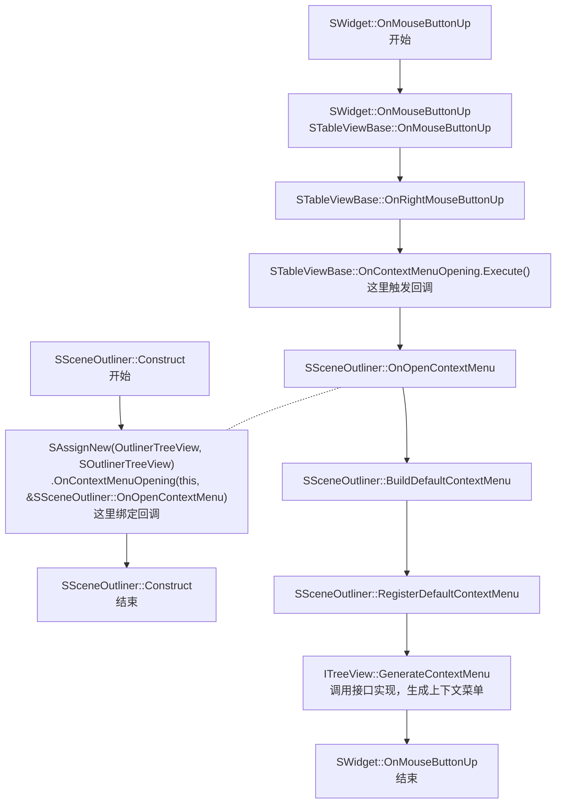

[TOC]


# SceneOutliner

## WorldTreeItem

是打开关卡后，世界大纲中的根节点就视为一个WorldTreeItem。代码中有一个`GenerateContextMenu`函数，其向`ToolMenu`注册了两个函数`Create Folder`和`World Settings`，在大纲中右键World根节点时可以看到注册的函数。

```c++
// Engine/Source/Editor/SceneOutliner/Private/WorldTreeItem.cpp

void FWorldTreeItem::GenerateContextMenu(UToolMenu* Menu, SSceneOutliner& Outliner)
{
	auto SharedOutliner = StaticCastSharedRef<SSceneOutliner>(Outliner.AsShared());
	
	const FSlateIcon WorldSettingsIcon(FEditorStyle::GetStyleSetName(), "LevelEditor.WorldProperties.Tab");
	const FSlateIcon NewFolderIcon(FEditorStyle::GetStyleSetName(), "SceneOutliner.NewFolderIcon");
	FToolMenuSection& Section = Menu->AddSection("Section");
	Section.AddMenuEntry("CreateFolder", LOCTEXT("CreateFolder", "Create Folder"), FText(), NewFolderIcon, FUIAction(FExecuteAction::CreateSP(this, &FWorldTreeItem::CreateFolder, TWeakPtr<SSceneOutliner>(SharedOutliner))));
	Section.AddMenuEntry("OpenWorldSettings", LOCTEXT("OpenWorldSettings", "World Settings"), FText(), WorldSettingsIcon, FExecuteAction::CreateSP(this, &FWorldTreeItem::OpenWorldSettings));
}

void FWorldTreeItem::CreateFolder(TWeakPtr<SSceneOutliner> WeakOutliner)
{
	auto Outliner = WeakOutliner.Pin();

	if (Outliner.IsValid() && SharedData->RepresentingWorld)
	{
		const FScopedTransaction Transaction(LOCTEXT("UndoAction_CreateFolder", "Create Folder"));

		const FName NewFolderName = FActorFolders::Get().GetDefaultFolderName(*SharedData->RepresentingWorld, "");
		FActorFolders::Get().CreateFolder(*SharedData->RepresentingWorld, NewFolderName);

		// At this point the new folder will be in our newly added list, so select it and open a rename when it gets refreshed
		Outliner->OnItemAdded(NewFolderName, ENewItemAction::Select | ENewItemAction::Rename);
	}
}

void FWorldTreeItem::OpenWorldSettings() const
{
	FLevelEditorModule& LevelEditorModule = FModuleManager::GetModuleChecked<FLevelEditorModule>( TEXT("LevelEditor") );
	LevelEditorModule.GetLevelEditorTabManager()->TryInvokeTab(FName("WorldSettingsTab"));	
}
```

## GetMutableDefault

通过该方法获取的config对象，可以修改对象的默认值。下一次再获取时即为修改后的默认值。

GetDefault不支持修改默认值。

## RegisterDefaultContextMenu

```c++
// Engine/Source/Editor/SceneOutliner/Private/SSceneOutliner.cpp

void SSceneOutliner::RegisterDefaultContextMenu()
{
	// ...
  if (Context->NumSelectedItems == 1)
  {
    SceneOutliner->GetTree().GetSelectedItems()[0]->GenerateContextMenu(InMenu, *SceneOutliner);
  }
  // ...
}
```

## ContextMenu register workflow

```c++
// STableViewBase.cpp
void STableViewBase::OnRightMouseButtonUp(const FPointerEvent& MouseEvent)
{
	const FVector2D& SummonLocation = MouseEvent.GetScreenSpacePosition();
	const bool bShouldOpenContextMenu = !IsRightClickScrolling();
	const bool bContextMenuOpeningBound = OnContextMenuOpening.IsBound();

	if (bShouldOpenContextMenu && bContextMenuOpeningBound)
	{
		// Get the context menu content. If NULL, don't open a menu.
		TSharedPtr<SWidget> MenuContent = OnContextMenuOpening.Execute();

		if (MenuContent.IsValid())
		{
			bShowSoftwareCursor = false;

			FWidgetPath WidgetPath = MouseEvent.GetEventPath() != nullptr ? *MouseEvent.GetEventPath() : FWidgetPath();
			FSlateApplication::Get().PushMenu(AsShared(), WidgetPath, MenuContent.ToSharedRef(), SummonLocation, FPopupTransitionEffect(FPopupTransitionEffect::ContextMenu));
		}
	}

	AmountScrolledWhileRightMouseDown = 0;
}

// SListView         inherit STableViewBase
// STreeView         inherit SListView
// SOutlinerTreeView inherit STreeView
```




